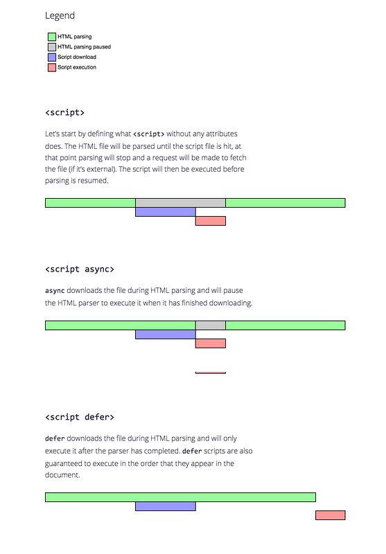

Author: _Yu Li_    
date: _2020/04/17_    
    
# html相关总结    
    
## 题目    
    
1. 事件冒泡/捕获    
事件冒泡是由内到外    
事件捕获是由外到内    
W3C标准规定，domNode.addEventListener(event,fn,usecapture)//事件，回调，是否开启捕获，true为捕获，false为冒泡    
IE标准规定，attachEvent    
详见<a href="/css/事件捕获和冒泡.html" target="_blank">/css/事件捕获和冒泡.html</a>    
    
2. 阻止冒泡的方法    
W3C e.stopPropagation()//此方法为阻止事件传递，包括捕获和冒泡    
IE e.CancelBubble() = true    
也可以在回调中 return false    
    
3. 阻止默认事件    
W3C e.preventDefault()    
IE e.returnValue = false    
也可以在回调中 return false    
    
4. document.onload和document.ready区别    
ready 是文档结构加载完（图片、静态资源没有）    
load 是所有元素都加载完    
    
5. URL查询参数    
```javascript    
let reg = new RegExp('(^|&)' + name + '=([^&]*)(&|$)');  
window.location.search.substr(1).match(reg) //返回数组  
```  
6. 节流：短时间避免多次调用同一函数，适用多次请求  
  
7. 防抖：多次操作取最后一次之后定时执行，适用撤回、页面滚动  
  
8. XSS攻击和CSRF攻击  
XSS(Cross Site Scripting，跨站脚本攻击）插入Script脚本攻击，预防：1.不用innerHTML，用innerText2.对innerHTML做过滤  
CSRF(Cross-Site Request Forgery，跨站点请求伪造)预防：1.后台Http Referer验证 2.token验证、后台拦截器验证  
  
9. 浏览器渲染过程  
解析HTML生成DOM树  
解析CSS生成CSSOM树  
合并生成渲染树  
遍历渲染树布局  
每个节点绘制屏幕上  
  
渲染阻塞：遇到Script标签，会执行完再构建  
位置原则：CSS优先，JS置后  
解析html会把新节点插入DOM树，同时查CSS规则，从右往左查  
渲染树内所有节点可见  
  
10. html标签化，就是标签有语义，如  
```html  
<header></header><footer></footer><main></main>  
```  
  
11. defer和async  
```html  
<script defer></script><!-- 异步加载，渲染完再执行，可保证执行顺序 -->  
<script async></script><!-- 异步加载，下载完就执行，无法保证执行顺序 -->  
<script type="module"></script><!-- 效果相当于defer -->  
```  

  
12. 路由hash和history区别  
hash：#开头，利用window.onhashchange事件进行监听，不会刷新页面，通过location.hash获取  
history：利用html5中pushState()和replaceState()方法，在back\forward\go基础上，点刷新会重新向后端发请求  
区别一：history比hash更美观  
区别二：hash#之前的URL才会发后端，history的URL需要后端有该URL的响应，否则会返回错误码  
history优势：  
1.pushState()修改任何同源URL，而hash只能在同文档URL#后面加值  
2.pushState()修改会入栈  
3.pushState()可添加任何类型，hash只能添加字符串  
4.可设置title属性  

13. [Web性能](https://developer.mozilla.org/zh-CN/docs/Web/Performance)  

14. 输入网址，回车之后的一系列过程描述？